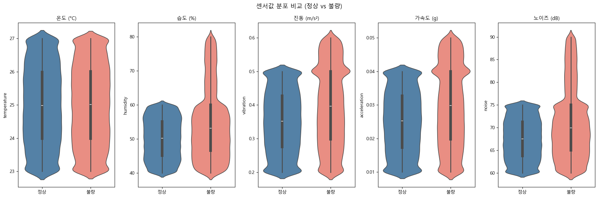
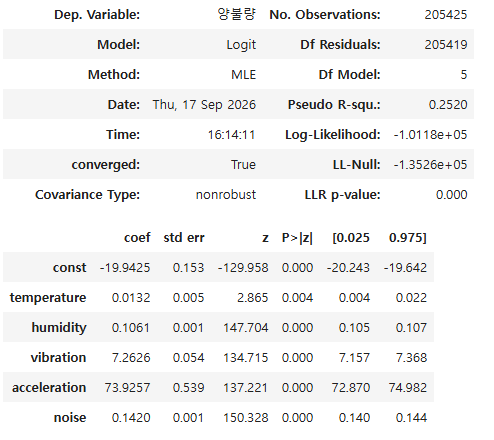

# **SMT 공정 불량 원인 분석 및 품질 개선 방안**

## 참여자
| 이름 | 역할 | 연락처 |
|:---:|:---:|:---:|
| 박천상 | 데이터 처리 및 과정 설계 |  |
| 박정현 | 데이터 시각화 및 분석 결과 정리 | |

## 데이터
- **데이터 출처:** [AI-Hub](https://www.aihub.or.kr/aihubdata/data/view.do?currMenu=115&topMenu=100&searchKeyword=SMT%20%EA%B3%B5%EC%A0%95%20%EA%B0%9C%EC%84%A0%20%EB%A9%80%ED%8B%B0%EB%AA%A8%EB%8B%AC%20%EB%8D%B0%EC%9D%B4%ED%84%B0&aihubDataSe=data&dataSetSn=71900)
- **데이터명:** SMT 공정 데이터
- **주요 변수:** 공정 환경 센서 데이터 (온도, 습도, 진동, 가속도, 소음)
- **활용 목적:**
    + 공정 환경 요인별 불량 발생과의 통계적 관계 분석
    + 센서 간 상호작용을 고려한 불량 발생 가능성 분석
    + 불량 발생 가능성이 낮은 공정 조건 탐색

## 배경
- 미납, 납부족, 납쇼트, 냉납 등의 불량 발생
- **제품 품질 저하 및 불량품 재처리로 인한 생산성 저하**

## 문제
- 어떤 요인이 불량 발생에 유의한 영향을 끼치는지 **불명확**
- 변화하는 공정 환경에서, **개별 요인의 영향과 불량률이 낮은 조건 확인 필요**

## 분석

### Q1. 불량 데이터와 정상 데이터의 공정 환경에는 실제로 차이가 있는가?
- 연구 가설: 
	+ 불량과 정상 데이터의 온도, 습도, 진동, 가속도, 소음 수준에 차이가 있을 것이다
- 방법론: EDA
	+ 정상/불량 데이터의 분포 및 평균 비교
	+ 온도, 습도, 진동, 가속도, 소음의 분포 시각화
- **결론: 온도 외의 센서에서 불량 데이터의 값이 정상 공정 환경 상한을 초과**

	

### Q2. 어떤 공정 환경 요인이 불량 발생과 통계적으로 유의한 관계가 있는가?
- 연구 가설: 
	+ 모든 센서가 동일하게 영향을 미치지는 않을 것이며, 일부 센서의 평균 또는 변동성이 불량 발생과 유의한 관계를 가질 것이다
- 방법론: 로지스틱 회귀 분석
- **결론: 습도, 진동, 가속도, 소음의 평균 및 표준편차는 불량 발생과 통계적으로 유의**

	

### Q3. 머신러닝을 활용해 공정 환경에 따른 불량 발생 가능성을 시뮬레이션할 수 있는가?
- 검증 목적: 센서 데이터를 활용하여 학습한 머신러닝 모델은 정상과 불량을 높은 정확도로 분류할 수 있을 것이다
- 방법론: 로지스틱 회귀 분석, Random Forest
- 결론: Random Forest에서 Accuracy 97.66%, F1-score 98.11%, ROC-AUC 98.25%로 **고정확도 분류 가능 입증**

### Q4. 각 공정 환경 요인의 변화에 따라 불량 발생 가능성은 얼마나 달라지는가?
- 연구 가설: 
	+ 센서별로 불량 발생 가능성에 미치는 영향의 크기가 다를 것이다.
- 방법론:
	+ 민감도 분석: 각 센서 변수를 -30% ~ +30% 변화시키며 예상 평균 불량률 변화 확인
- **결론:**
	+ **온도 외의 변수 평균값에서 예상 불량률이 크게 변화**
	+ 표준편차는 유의하지 않은 영향
	+ **평균적인 공정 환경 수준이 주요 관리 대상**

### Q5. 여러 공정 환경 조건을 조합했을 때 불량 발생 가능성이 낮은 조건을 찾을 수 있는가?
- 연구 가설:	
	+ 개별 센서의 영향뿐만 아니라 여러 센서의 조합에 따라 불량률이 달라질 것이며, 상대적으로 불량률이 낮은 조건을 도출할 수 있을 것이다
- 방법론:
	+ 공정 조건에 따른 시나리오 시뮬레이션 분석
		* 민감도 분석 결과를 기반으로 온도를 제외한 공정 환경 값을 **Low / Mid / High로 구간화** → **총 81개의 조건 생성**
		* 센서값 연속형 → 구간화를 통해 **계산 효율성과 해석 용이성 확보, 모든 조합 전수 탐색**
		* Q3 Random Forest 모델을 통해 각 조건의 예상 불량률 비교
- **결론:**
	+ **최적 조건에서 예상 불량률: 1.67%**
	
		`소음: 68.893 | 습도: 45.902 | 진동: 0.3766 | 가속도: 0.0277`

	|   noise_mean |   humidity_mean |   vibration_mean |   acceleration_mean |   불량 예측률 |
	|-------------:|----------------:|-----------------:|--------------------:|--------------:|
	|      68.893  |          45.902 |          0.37658 |             0.0277  |     0.0166667 |
	|      68.893  |          51.79  |          0.37658 |             0.0277  |     0.0166667 |
	|      73.36   |          45.902 |          0.37658 |             0.01884 |     0.0166667 |
	|      68.893  |          45.902 |          0.37658 |             0.01884 |     0.02      |
	|      68.893  |          45.902 |          0.37658 |             0.03692 |     0.02      |
	|      64.4515 |          51.79  |          0.37658 |             0.0277  |     0.0233333 |
	|      64.4515 |          51.79  |          0.37658 |             0.03692 |     0.0233333 |
	|      64.4515 |          51.79  |          0.37658 |             0.01884 |     0.0233333 |
	|      68.893  |          45.902 |          0.46766 |             0.0277  |     0.0233333 |
	|      68.893  |          57.628 |          0.37658 |             0.0277  |     0.0233333 |

## 한계
- 본 분석의 불량률은 머신러닝 모델 기반 산출값으로, **실제 환경에서의 검증 필요**
- **불량 유형별** 공정 환경의 미세한 차이에 대한 추가 연구 필요
